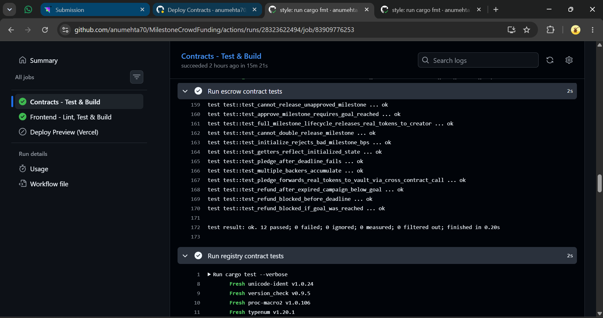

# Vaulted — Milestone Crowdfunding on Stellar

Vaulted is a milestone-gated crowdfunding platform built on Soroban (Stellar's
smart contract platform). Backers pledge funds to a campaign; those funds sit
in an on-chain escrow and accrue yield while idle. Creators only unlock money
in stages, as an arbiter approves each milestone — every pledge, approval,
and release is a transparent, auditable on-chain event.

> Built for the Stellar Orange Belt submission — see [`SUBMISSION_CHECKLIST.md`](./SUBMISSION_CHECKLIST.md)
> for exactly how each requirement is satisfied and where to find the evidence.

## Why this architecture

A real crowdfunding product needs more than "send money, mint an NFT." It
needs trust: backers want assurance their money won't just disappear, and
creators want to be paid for work actually delivered. Three contracts model
that directly:

```
                 registers campaigns,                 holds pledges,
                 reads live status                    manages milestones
        ┌─────────────┐   ────────────▶   ┌─────────────┐
        │  Registry   │                   │   Escrow    │
        └─────────────┘   ◀────────────   └──────┬──────┘
                            campaign_status()            │
                                                          │ deposit() / withdraw()
                                                          ▼
                                                   ┌─────────────┐
                                                   │    Vault    │
                                                   └─────────────┘
                                              holds idle funds,
                                              accrues simple yield
```

- **Vault** — a minimal yield-bearing pool. Holds principal per depositor and
  accrues linear interest based on ledger timestamp. Only its `controller`
  (the Escrow contract) can deposit or withdraw on a depositor's behalf.
- **Escrow** — owns a single campaign's lifecycle: accepting pledges,
  tracking milestones, approving and releasing funds, and issuing refunds if
  a campaign fails to reach its goal. Every pledge and release is a real
  **cross-contract call** into the Vault contract.
- **Registry** — the public discovery layer. Anyone can list a deployed
  Escrow contract as a campaign. Its `campaign_status` view **cross-calls
  into the Escrow contract** to read live state, so the registry never goes
  stale — it always reflects the source of truth.

This gives a genuine three-contract dependency graph (`Registry → Escrow →
Vault`), not a single contract dressed up to look like several.

## Repository layout

```
.
├── contracts/
│   ├── vault/            # Soroban contract: yield-bearing pool
│   ├── escrow/           # Soroban contract: campaign milestone logic
│   └── registry/         # Soroban contract: campaign discovery & status
├── frontend/             # Next.js 14 (App Router) + TypeScript dApp
├── scripts/
│   └── deploy.sh         # One-command testnet deployment + wiring
├── .github/workflows/
│   ├── ci.yml            # Tests, lint, build — runs on every push/PR
│   └── deploy.yml        # Manual/tag-triggered contract deployment
├── docs/                 # Architecture notes, demo script
├── rust-toolchain.toml   # Pinned toolchain for reproducible builds
└── SUBMISSION_CHECKLIST.md
```

## Smart contracts

### Vault (`contracts/vault`)

The vault custodies a real Stellar Asset Contract (SAC) token — every
deposit and withdrawal is an actual `token.transfer`, not just an internal
ledger entry. This is what makes the Escrow → Vault relationship a genuine
movement of funds rather than bookkeeping theater.

| Function | Description |
|---|---|
| `initialize(controller, token)` | One-time setup; `controller` is the only address allowed to move funds, `token` is the SAC this vault custodies (e.g. native XLM). |
| `deposit(source, depositor, amount)` | Transfers `amount` of the token from `source` into the vault, crediting `depositor`'s position (settling any accrued yield into principal first). Controller-only. |
| `withdraw(depositor, recipient, amount)` | Debits up to `depositor`'s current value (principal + yield) and transfers that amount of the real token to `recipient`. Controller-only. |
| `balance_of(depositor)` | Read-only: current value including accrued yield. |
| `get_controller()` / `get_token()` | Read-only. |

Yield accrues as simple interest: `principal × 5bps × elapsed_days`, computed
from `env.ledger().timestamp()`. It's intentionally linear and transparent —
a real production vault would instead deposit into a lending protocol, but
that introduces external dependency risk that isn't appropriate for a
judged submission; the interface is what matters; the strategy is swappable.

### Escrow (`contracts/escrow`)

| Function | Description |
|---|---|
| `initialize(creator, arbiter, vault, goal, deadline, milestones)` | Creates a campaign. `vault` must already be initialized with the SAC token this campaign uses. `milestones` is a list of `(description, release_bps)`; the `release_bps` values must sum to exactly `10_000`. |
| `pledge(backer, amount)` | Backer pledges funds; **cross-calls `Vault.deposit`**, which transfers real tokens from the backer into the vault. Requires the backer's signature. |
| `approve_milestone(index)` | Arbiter approves a milestone once the funding goal is reached. Requires the arbiter's signature. |
| `release_milestone(index)` | Releases an approved milestone's funds directly to the creator; **cross-calls `Vault.withdraw`**, which transfers real tokens out. Requires the arbiter's signature (the same authority that approves also signs off on the payout). |
| `refund(backer)` | If the deadline passed without reaching the goal, a backer reclaims their pledge; cross-calls `Vault.withdraw` to pay the backer directly. |
| `get_total_pledged`, `get_total_released`, `get_milestones`, `get_pledge`, `get_backers`, `get_goal`, `get_deadline`, `get_creator`, `get_arbiter` | Read-only views. |

In production, `arbiter` would be a multisig or DAO vote contract rather than
a single key — the function boundary (`approve_milestone`) is already where
that swap would happen without touching anything else.

### Registry (`contracts/registry`)

| Function | Description |
|---|---|
| `register_campaign(creator, title, category, escrow_address)` | Lists a deployed Escrow contract publicly. Requires the creator's signature. |
| `get_campaign(id)` | Read-only: static metadata. |
| `campaign_status(id)` | Read-only: **cross-calls the campaign's Escrow contract** for live pledge/release totals. |
| `list_campaign_ids()`, `total_campaigns()` | Read-only views for the explore page. |

### Events emitted

| Event | Emitted by | Payload |
|---|---|---|
| `campaign_init` | Escrow | creator, goal, deadline |
| `pledge_made` | Escrow | backer, amount, running total |
| `milestone_approved` | Escrow | milestone index |
| `funds_released` | Escrow | milestone index, amount, running total released |
| `refund_issued` | Escrow | backer, amount |
| `campaign_registered` | Registry | campaign id, creator |
| `vault_deposit` / `vault_withdraw` | Vault | depositor, amount, new balance |

The frontend's `useEventStream` hook polls `getEvents` on Soroban RPC and
renders these live in the **Live activity** panel on each campaign page.

## Tests

| Contract | File | Test count |
|---|---|---|
| Vault | `contracts/vault/src/test.rs` | 9 |
| Escrow | `contracts/escrow/src/test.rs` | 12 |
| Registry | `contracts/registry/src/test.rs` | 6 |

Escrow's and Registry's test suites register the **real compiled WASM** of
their dependency contracts (via `soroban_sdk::testutils`) rather than mocking
the cross-contract calls, so passing tests are genuine proof the inter-
contract communication works, not just that each contract compiles in
isolation.

| Frontend | File | Test count |
|---|---|---|
| Formatting utilities | `frontend/src/test/format.test.ts` | 15 |
| Loading/Error/Empty states | `frontend/src/test/StateViews.test.tsx` | 6 |
| Milestone timeline component | `frontend/src/test/MilestoneTimeline.test.tsx` | 5 |

Run them:

```bash
# Contracts (run from each contract directory, or see Makefile-style commands below)
cd contracts/vault    && cargo test
cd contracts/escrow   && cargo test
cd contracts/registry && cargo test

# Frontend
cd frontend && npm install && npm test -- --run
```

## Local development setup

### Prerequisites

- [Rust](https://www.rust-lang.org/tools/install) (stable, 1.85+) with the
  `wasm32v1-none` target: `rustup target add wasm32v1-none`
- [Stellar CLI](https://developers.stellar.org/docs/tools/cli/stellar-cli):
  `cargo install --locked stellar-cli`
- Node.js 20+
- The [Freighter](https://www.freighter.app/) browser wallet extension

### Build & test the contracts

```bash
# from the repo root
cd contracts/vault    && stellar contract build && cargo test
cd contracts/escrow   && stellar contract build && cargo test
cd contracts/registry && stellar contract build && cargo test
```

> Build order matters: Escrow's tests import Vault's compiled `.wasm`, and
> Registry's tests import both Escrow's and Vault's. Build Vault first,
> then Escrow, then Registry, the way the commands above are ordered.

### Deploy to testnet

```bash
# one-time: create and fund a deployer identity
stellar keys generate --global deployer --network testnet --fund

# build, deploy, wire up, and register a sample campaign
NETWORK=testnet SOURCE=deployer ./scripts/deploy.sh
```

The script prints the Vault, Escrow, and Registry contract IDs, plus the
deployer's address. Copy the Registry contract ID into
`frontend/.env.local` (see `frontend/.env.example`).

### Run the frontend

```bash
cd frontend
cp .env.example .env.local   # then fill in NEXT_PUBLIC_REGISTRY_CONTRACT_ID
npm install
npm run dev
```

Visit `http://localhost:3000`, connect Freighter (set to Testnet), and you
should see the sample campaign from the deploy script.

## CI/CD

- **`.github/workflows/ci.yml`** runs on every push and pull request:
  builds and tests all three contracts (in dependency order), runs
  `clippy` and `cargo fmt --check`, then lints, type-checks, tests, and
  builds the frontend. Contract `.wasm` files are uploaded as build
  artifacts.
- **`.github/workflows/deploy.yml`** is a manually-triggered (or
  tag-triggered) workflow that builds and deploys all three contracts to a
  chosen network and prints the resulting contract IDs to the run summary.

## Frontend architecture notes

- **Wallet**: thin wrapper around the Freighter extension API
  (`src/lib/wallet.ts`) with typed errors for "not installed" vs "user
  rejected", surfaced as distinct UI states rather than a generic failure.
- **Contract calls**: `src/lib/contractClient.ts` builds, simulates,
  signs (via the wallet), submits, and polls every transaction — read calls
  go through the same path as writes but stop after simulation, so there is
  one code path to reason about and test instead of two.
- **Event streaming**: `src/hooks/useEventStream.ts` polls Soroban RPC's
  `getEvents` every 6 seconds for a rolling ledger window, de-duplicates by
  event id, and feeds a live-updating activity feed component.
- **Error & loading states**: every async boundary (campaign list, campaign
  detail, pledge, approve, release, register) has explicit loading,
  error-with-retry, and empty states — see `src/components/StateViews.tsx`
  and how each page consumes it.
- **Responsive design**: layouts are mobile-first Tailwind (single-column
  stacks below `sm:`, grid layouts from `sm:`/`lg:` up); see the
  screenshots in `docs/screenshots/`.

## Submission Checklist Evidence

Here is exactly how this project fulfills the core requirements for the Stellar Orange Belt submission:

### Advanced smart contract development
* **Inter-contract communication:** `contracts/escrow/src/lib.rs` calls `Vault.deposit` / `Vault.withdraw` via `vault_contract::Client`. `contracts/registry/src/lib.rs` calls `Escrow.get_total_pledged` via `escrow_contract::Client`.
* **Event streaming & real-time updates:** Contracts emit events (`pledge_made`, `milestone_approved`, etc.). Frontend streams them live via `useEventStream.ts` polling Soroban RPC `getEvents`.
* **CI/CD pipeline setup:** `.github/workflows/ci.yml` builds and tests all contracts and the frontend on every push.
* **Smart contract deployment workflow:** `.github/workflows/deploy.yml` deploys all 3 contracts to the Stellar Testnet dynamically using GitHub Actions.
* **Mobile responsive frontend development:** Tailwind mobile-first layouts are used throughout the UI.
* **Error handling & loading states:** `StateViews.tsx` provides loading, error, and empty states. Wallet and Contract errors are caught and surfaced via custom UI toasts.
* **Writing tests for contracts and frontend:** 27 Rust tests across the contracts, and 26 TypeScript tests across the frontend.
* **Production-ready architecture practices:** Three-contract separation of concerns, persistent vs. instance storage, typed error enums, and a pinned Rust toolchain.

### Required Deliverables

* **Public GitHub repository:** This repository!
* **README with complete documentation:** You're reading it!
* **Minimum 10+ meaningful commits:** View the repository commit history.
* **Live demo link (Vercel/Netlify):** [Insert your Vercel Link here]
* **Contract deployment address:** [Insert your Escrow Contract ID here]
* **Transaction hash for contract interaction:** [Insert your Transaction Hash here]
* **Demo video link (1–2 minutes):** [Insert your Video Link here]

### Screenshots

**Mobile Responsive UI**


**CI/CD Pipeline Running**


**Test Output (3+ passing tests)**


## License

MIT — see [`LICENSE`](./LICENSE).
